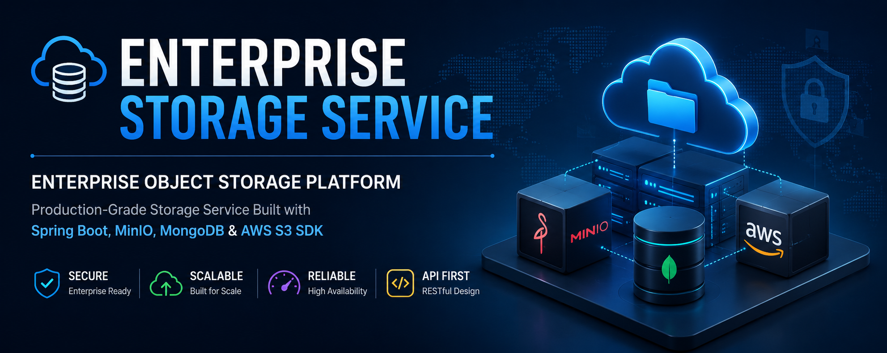
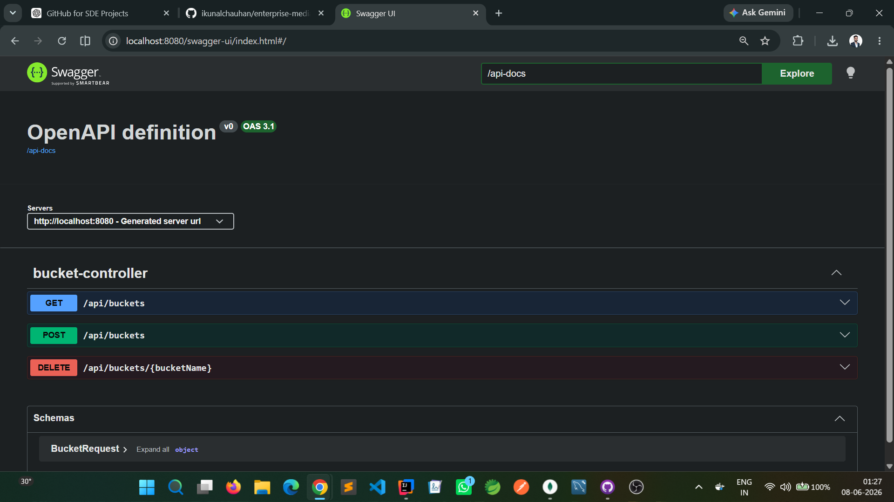

# 🚀 Enterprise Storage Service

<div align="center">

# ☁️ Enterprise Object Storage Platform

### Production-Grade Storage Service Built with Spring Boot, MinIO, MongoDB & AWS S3 SDK




### 🎯 Building an Enterprise-Grade Storage Platform Inspired by Amazon S3

</div>

---

# 📖 Overview

Enterprise Storage Service is a production-oriented backend application inspired by modern cloud storage solutions such as Amazon S3, MinIO, Dropbox, and Google Cloud Storage.

The objective of this project is to build a scalable object storage platform while mastering enterprise backend engineering practices.

---

# 🏆 Current Milestone

## Version: v0.2.0

### Bucket Management & API Documentation Completed

✅ Bucket Creation API

✅ Bucket Deletion API

✅ Bucket Listing API

✅ DTO Layer

✅ Service Layer

✅ Controller Layer

✅ MinIO Integration

✅ AWS S3 SDK Integration

✅ Swagger/OpenAPI Documentation

---

# 🏗️ System Architecture

```text
                    Client
                       │
                       ▼
           Spring Boot REST APIs
                       │
               AWS S3 SDK v2
                       │
         ┌─────────────┴─────────────┐
         ▼                           ▼
      MinIO                      MongoDB
 Object Storage            Metadata Storage
```

---

# 🛠️ Technology Stack

| Layer | Technology |
|---------|------------|
| Language | Java 21 |
| Framework | Spring Boot 3 |
| Object Storage | MinIO |
| Database | MongoDB |
| Cloud SDK | AWS S3 SDK v2 |
| API Documentation | Swagger/OpenAPI |
| Validation | Jakarta Validation |
| Build Tool | Maven |
| Security | Spring Security (Planned) |
| Deployment | Docker (Planned) |

---

# 📡 Implemented APIs

| Method | Endpoint | Description |
|----------|----------|-------------|
| POST | `/api/buckets` | Create Bucket |
| GET | `/api/buckets` | List Buckets |
| DELETE | `/api/buckets/{bucketName}` | Delete Bucket |

---

# 📸 Milestone 1 Screenshots

## Swagger UI

Place today's screenshot here:

```text
docs/screenshots/milestone-01/swagger-bucket-management.png
```



---

## Bucket Creation API

```text
docs/screenshots/milestone-01/bucket-create.png
```

---

## Bucket Listing API

```text
docs/screenshots/milestone-01/bucket-list.png
```

---

## MinIO Console Verification

```text
docs/screenshots/milestone-01/minio-console.png
```

---

# 📂 Project Structure

```text
enterprise-storage-service

├── docs
│   ├── architecture
│   ├── banner
│   └── screenshots
│
├── src
│   ├── config
│   ├── controller
│   ├── dto
│   ├── entity
│   ├── exception
│   ├── repository
│   ├── service
│   └── util
│
├── postman
├── docker
└── README.md
```

---

# 📈 Progress Dashboard

## Completed

- [x] Spring Boot Setup
- [x] MongoDB Configuration
- [x] MinIO Configuration
- [x] AWS S3 SDK Integration
- [x] Bucket Management APIs
- [x] Swagger/OpenAPI Integration

## In Progress

- [ ] Object Upload Module

## Planned

- [ ] Object Download Module
- [ ] Metadata Persistence
- [ ] Rename Object
- [ ] Move Object
- [ ] Copy Object
- [ ] Validation Layer
- [ ] Exception Handling
- [ ] Structured Logging
- [ ] JWT Authentication
- [ ] Docker Deployment
- [ ] CI/CD Pipeline
- [ ] Presigned URLs
- [ ] Streaming Support

---

# 🚀 Release History

| Version | Description | Status |
|----------|------------|---------|
| v0.1.0 | Project Initialization | ✅ |
| v0.2.0 | Bucket Management + Swagger Documentation | ✅ |
| v0.3.0 | Object Upload Module | 🚧 |
| v0.4.0 | Download Module | ⏳ |
| v1.0.0 | Production Release | ⏳ |

---

# 🔄 Future CI/CD Pipeline

```text
Developer Push
      │
      ▼
GitHub Actions
      │
      ▼
Build
      │
      ▼
Unit Tests
      │
      ▼
Package
      │
      ▼
Deploy
```

---

# 🧠 Engineering Principles

- Clean Architecture
- SOLID Principles
- Layered Design
- Production Readiness
- Cloud Storage Integration
- API-First Development
- Scalability & Maintainability

---

# 👨‍💻 Author

### Kunal

Backend Developer

Java • Spring Boot • MongoDB • MinIO • AWS S3 • Distributed Storage

⭐ Building production-grade backend systems one milestone at a time.
